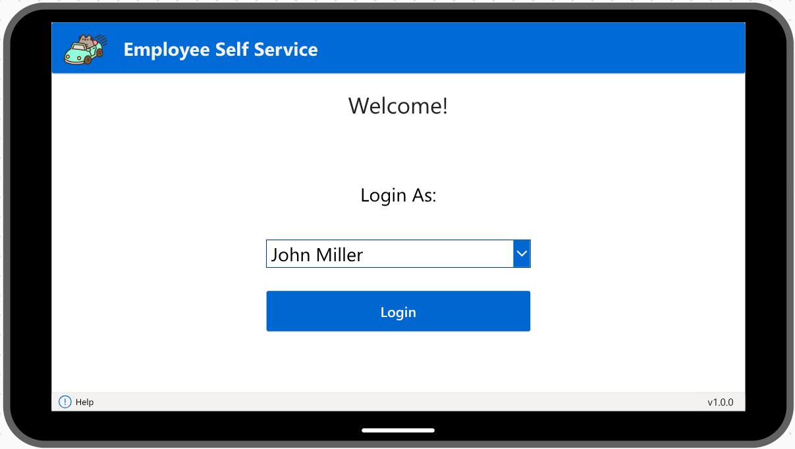
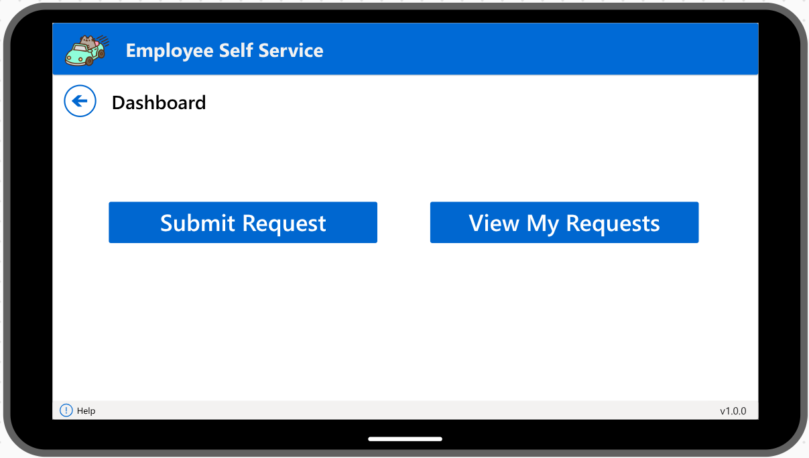
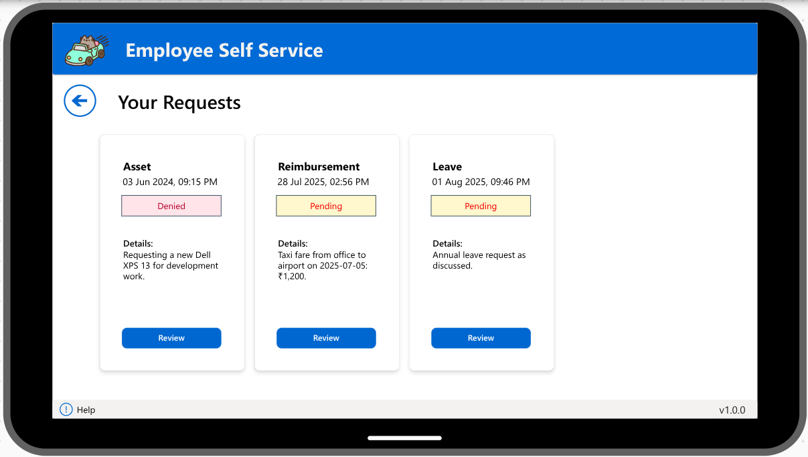
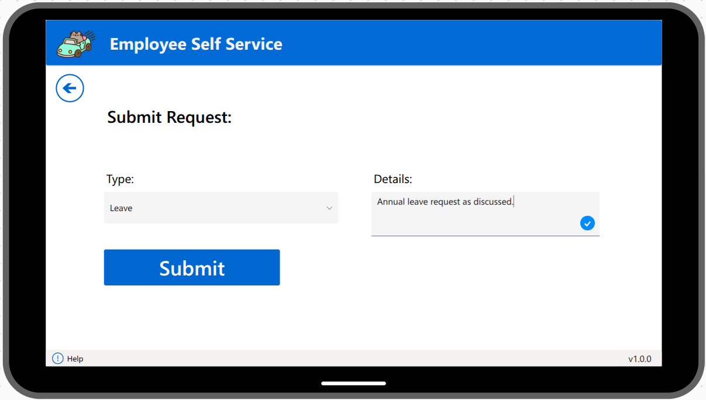
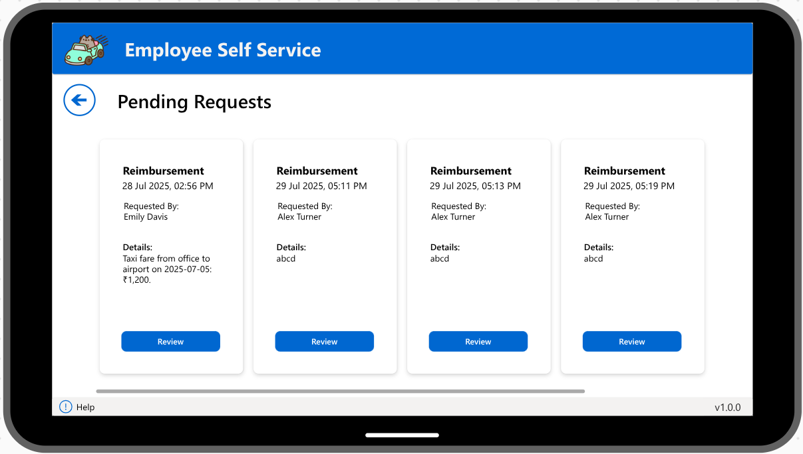
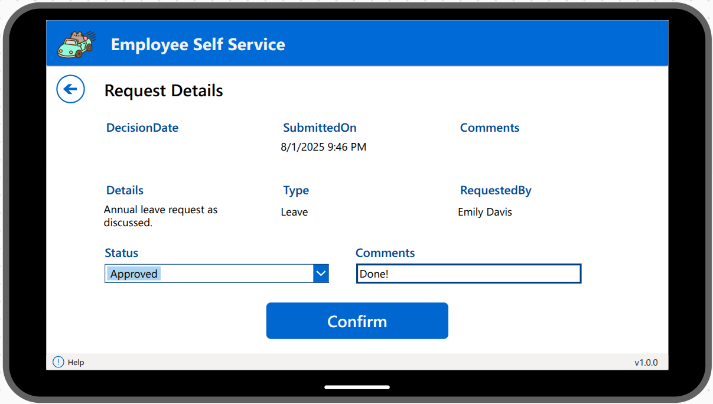

# Employee Self-Service Portal (Power Platform)

A no-code/low-code solution built with **Microsoft Power Apps**, **Power Automate**, and **Dataverse** to manage common HR workflows — such as leave, reimbursement, and asset requests — for both employees and managers.

> **Video demo coming soon**  
> Scroll below for screenshots

---

## 🚀 Overview

The Employee Self-Service Portal allows simulated employees to submit requests and track their statuses, while managers can review, approve, or deny them. Built entirely using the Microsoft Power Platform, it showcases data modeling in Dataverse, role-based UI logic in Power Apps, and email automation via Power Automate.

---

## 👥 User Roles

To simulate real users, a dropdown is used for role selection:

- **Employee** – Can submit new requests and view their own request history
- **Manager** – Can view, approve, or reject pending requests submitted by others

---

## 🧩 App Screens

| Screen Name          | Visible To         | Purpose                                                   |
|----------------------|--------------------|------------------------------------------------------------|
| **Home**             | All users          | Navigation + user welcome + role selection                |
| **Submit Request**   | Employee           | Submit a Leave / Reimbursement / Asset request            |
| **My Requests**      | Employee           | Track status of all personal submissions                  |
| **Manager Dashboard**| Manager            | View and act on all pending requests                      |
| **Request Details**  | Employee & Manager | View complete request details, update status, add comments|

---

## 🖥️ Key Screen Features

### 🏠 Home Screen
- Displays welcome message using `User().FullName`
- Dropdown to simulate role selection (`Employee` or `Manager`)
- Role-based buttons:
  - “Submit Request” (Employee)
  - “View My Requests” (Employee)
  - “Review Requests” (Manager)

### 📤 Submit Request Screen (Employee)
- Dropdown: Request Type (Leave / Reimbursement / Asset)
- Multiline text input for details
- Submit button triggers a **Patch** to Dataverse
- Success message + redirect to My Requests

### 📋 My Requests Screen (Employee)
- Gallery showing all requests submitted by the logged-in user
- Fields shown: Type, Status, SubmittedOn
- Click on any item to view full details

### 📊 Manager Dashboard
- Gallery filtered to show:
  - Requests with Status = `Pending`
  - Where Manager = CurrentUser
- Cards display request type, summary, and submitter
- “View Details” button opens request

### 🔍 Request Details Screen
- Displays full request data: Type, Details, Status, Comments
- Employee: read-only view
- Manager: can update Status (Approve/Deny) + add Comments
- Submit Decision button:
  - Updates Dataverse
  - Triggers **email flow** to notify the employee

---

## 🧱 Dataverse Schema

### 📘 Employees Table
| Column       | Type                          | Description                  |
|--------------|-------------------------------|------------------------------|
| EmployeeID   | Autonumber (Primary Key)       | Unique ID                    |
| Name         | Text                           | Full name                    |
| Email        | Email                          | Simulated login              |
| Role         | Choice (Employee / Manager)    | Simulated user role          |
| Manager      | Lookup (to Employees)          | Assigned manager             |

### 📝 Requests Table
| Column        | Type                           | Description                        |
|---------------|--------------------------------|------------------------------------|
| RequestID     | Autonumber (Primary Key)        | Unique ID                          |
| Type          | Choice (Leave / Reimbursement / Asset) | Request category            |
| Details       | Multiline Text                 | Request explanation or note        |
| Status        | Choice (Pending / Approved / Denied) | Updated by manager            |
| RequestedBy   | Lookup (Employees)             | Who submitted the request          |
| ReviewedBy    | Lookup (Employees)             | Who reviewed the request           |
| SubmittedOn   | DateTime                       | Auto-generated on submit           |
| DecisionDate  | DateTime                       | When decision was made             |
| Comments      | Multiline Text                 | Manager feedback (optional)        |

---

## ⚙️ Power Automate Flows

| Flow Name                    | Trigger               | Actions                          |
|-----------------------------|------------------------|----------------------------------|
| Notify Manager of New Request | On new request created | Send email to assigned manager   |
| Notify Employee of Approval   | On request update      | Send decision email to employee  |

---

## 📈 Future Enhancements

- File attachments (e.g. receipts, documents)
- Calendar integration for leave tracking
- Performance review module
- Admin analytics dashboard (Power BI)
- Audit logs for tracking all user actions

---

## 📸 Screenshots

- 
- 
- 
- 
- 
- 

---

## 📽️ Demo

> 🎥 **Video demo coming soon** – walk-through of all screens and workflows

---

## 🛠️ Built With

- **Power Apps (Canvas App)**
- **Dataverse (Tables & Relationships)**
- **Power Automate (Email Flows)**
- **SharePoint (optional for future extensions)**

---

## 📬 Contact

For questions or demo access, feel free to [email me](mailto:bulandchoudhary1@gmail.com) or connect on [LinkedIn](https://www.linkedin.com/in/buland-choudhary/).

---

